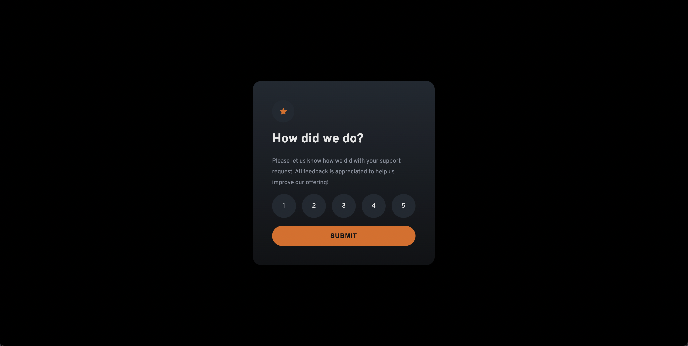
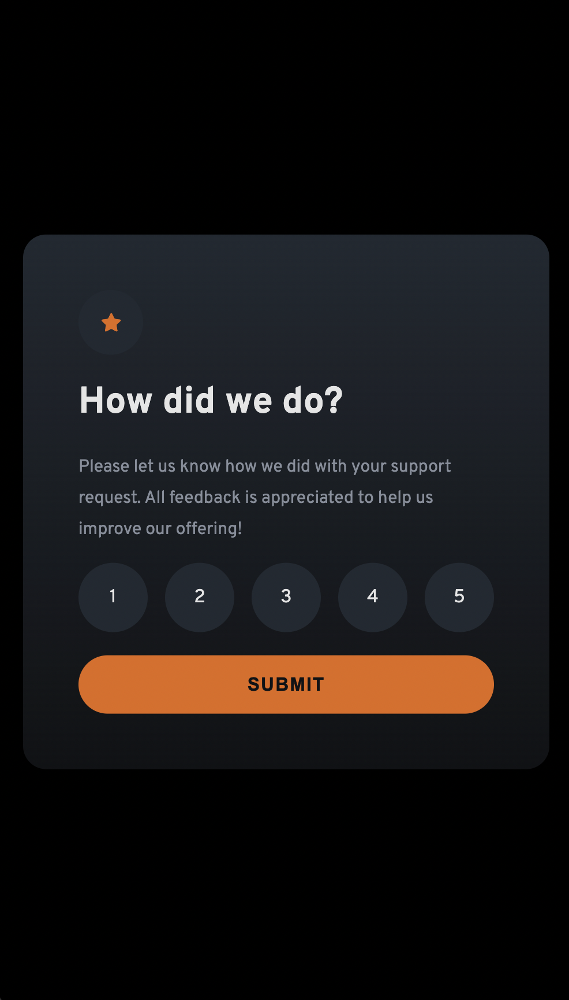

# Frontend Mentor - Interactive rating component solution

This is a solution to the [Interactive rating component challenge on Frontend Mentor](https://www.frontendmentor.io/challenges/interactive-rating-component-koxpeBUmI). Frontend Mentor challenges help you improve your coding skills by building realistic projects.

## Table of contents

- [Overview](#overview)
  - [The challenge](#the-challenge)
  - [Screenshot](#screenshot)
  - [Links](#links)
- [My process](#my-process)
  - [Built with](#built-with)
  - [What I learned](#what-i-learned)
- [Author](#author)


## Overview

### The challenge

Users should be able to:

- View the optimal layout for the app depending on their device's screen size
- See hover states for all interactive elements on the page
- Select and submit a number rating
- See the "Thank you" card state after submitting a rating

### Screenshot




### Links

- Solution URL: [Github](https://github.com/phanindra28/interactive-rating-component)
- Live Site URL: [Live](https://phanindra28.github.io/interactive-rating-component/)

## My process

### Built with

- Semantic HTML5 markup
- CSS custom properties
- Flexbox
- CSS Grid
- [React](https://reactjs.org/) - JS library
- Vite - Project Setup


### What I learned

This challenge gave me a good exposure on styling. I have learned how to use background images for applying fading background.
Also, I've used Vite for the first time to set up the project. It is a great tool for setting up react projects. It is very fast and easy to use.
It was a new learning on how to deploy vite app to GitHub pages.

```css

## Author

- Frontend Mentor - [@Phanindra28](https://www.frontendmentor.io/profile/phanindra28)
- Github - [phanindra28](https://github.com/phanindra28/)